# VibeBuild -- Полное описание проекта

## Содержание

- [Введение](#введение)
- [Связь с техническим заданием](#связь-с-техническим-заданием)
- [Архитектура системы](#архитектура-системы)
- [Компоненты VibeBuild](#компоненты-vibebuild)
  - [Analyzer -- анализ SRPM](#1-analyzer----анализ-srpm)
  - [Name Resolver -- разрешение имён пакетов](#2-name-resolver----разрешение-имён-пакетов)
  - [Resolver -- разрешение зависимостей](#3-resolver----разрешение-зависимостей)
  - [Fetcher -- скачивание SRPM](#4-fetcher----скачивание-srpm)
  - [Builder -- оркестрация сборки](#5-builder----оркестрация-сборки)
- [Разрешение имён пакетов](#разрешение-имён-пакетов)
  - [Проблема](#проблема)
  - [Rule-based разрешение](#rule-based-разрешение)
  - [ML-компонент](#ml-компонент)
- [Полный цикл работы vibebuild](#полный-цикл-работы-vibebuild)
- [Диаграмма последовательности](#диаграмма-последовательности)
- [Разрешение зависимостей и DAG](#разрешение-зависимостей-и-dag)
- [Сравнение koji build и koji vibebuild](#сравнение-koji-build-и-koji-vibebuild)
- [Теги и таргеты Koji](#теги-и-таргеты-koji)
- [Иерархия ошибок](#иерархия-ошибок)
- [Структура проекта](#структура-проекта)
- [Ansible-инфраструктура](#ansible-инфраструктура)
- [CLI -- командный интерфейс](#cli----командный-интерфейс)

---

## Введение

**VibeBuild** -- расширение системы сборки [Koji](https://docs.pagure.org/koji/), которое автоматизирует разрешение зависимостей при сборке RPM-пакетов.

Стандартная команда `koji build` собирает один пакет и требует, чтобы все BuildRequires (зависимости для сборки) уже были доступны в репозитории Koji. Если зависимость отсутствует, сборка падает с ошибкой.

**VibeBuild** решает эту проблему: команда `vibebuild` автоматически:

1. Анализирует SRPM-пакет и извлекает список BuildRequires
2. Проверяет, какие зависимости отсутствуют в Koji
3. Скачивает SRPM для недостающих пакетов из Fedora
4. Рекурсивно разрешает зависимости зависимостей
5. Строит граф зависимостей (DAG) и определяет порядок сборки
6. Собирает все пакеты в правильном порядке, ожидая регенерации репозитория между уровнями

---

## Связь с техническим заданием

Проект реализует следующее ТЗ:

| Требование ТЗ | Реализация в проекте |
|---|---|
| Взять KOJI пакет в open source | Koji используется как внешняя зависимость (CLI `koji`) |
| Развернуть VPS, поставить Koji | Ansible-плейбук в `ansible/` для автоматического деплоя |
| SRPM Source / RPM Binary | Analyzer (`analyzer.py`) работает с SRPM (Source RPM), Builder (`builder.py`) создает RPM (Binary) через Koji |
| `KOJI BUILD [NAME PACK]` | Поддержка через `vibebuild --no-deps TARGET SRPM` (прямая сборка без разрешения зависимостей) |
| `KOJI VIBEBUILD [PACKAGENAME]` | Основная команда `vibebuild TARGET SRPM` -- сборка с автоматическим разрешением зависимостей |
| Подгрузка зависимостей | Fetcher (`fetcher.py`) скачивает SRPM из Fedora Koji и src.fedoraproject.org |
| BUILD других зависимостей | Builder (`builder.py`) собирает зависимости по уровням DAG перед сборкой основного пакета |

---

## Архитектура системы

### Общая архитектура

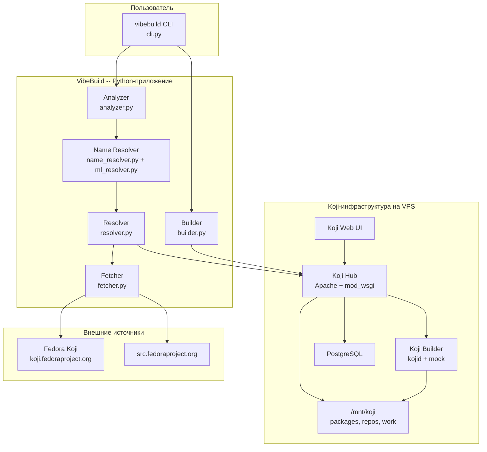

### Взаимодействие компонентов VibeBuild

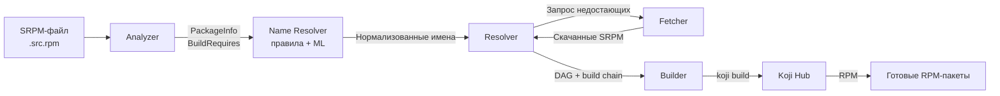

---

## Компоненты VibeBuild

### 1. Analyzer -- анализ SRPM

**Файл:** `vibebuild/analyzer.py`

**Ответственность:** парсинг SRPM и spec-файлов, извлечение метаданных пакета.

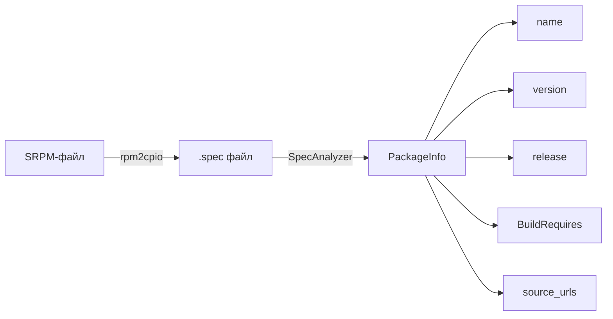

**Ключевые классы и функции:**

- `SpecAnalyzer` -- парсер spec-файлов. Извлекает Name, Version, Release, BuildRequires и Source URLs
- `BuildRequirement` -- dataclass, представляющий одну зависимость (имя, версия, оператор)
- `PackageInfo` -- dataclass с полной информацией о пакете
- `get_build_requires(srpm_path)` -- извлекает список BuildRequires из SRPM через `rpm -qp --requires`
- `get_package_info_from_srpm(srpm_path)` -- извлекает полную информацию: распаковывает SRPM через `rpm2cpio | cpio`, находит .spec файл и парсит его

**Алгоритм парсинга spec:**

1. Читает файл построчно
2. Извлекает поля `Name:`, `Version:`, `Release:`, `BuildRequires:`, `Source:`
3. Раскрывает макросы RPM (`%{name}`, `%{version}`)
4. Парсит строки BuildRequires с учетом операторов версий (`>=`, `<=`, `>`, `<`, `=`)

---

### 2. Name Resolver -- разрешение имён пакетов

**Файлы:** `vibebuild/name_resolver.py`, `vibebuild/ml_resolver.py`

**Ответственность:** преобразование виртуальных имён зависимостей из spec-файлов в реальные имена RPM-пакетов, а также маппинг RPM-имён в SRPM-имена.

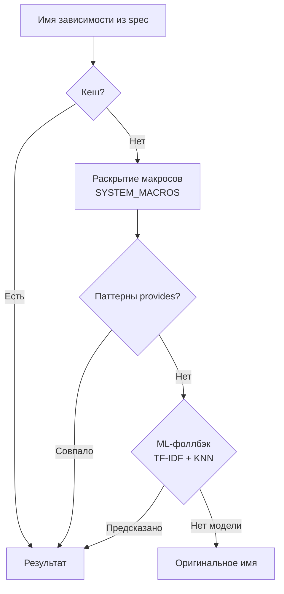

**Ключевые классы:**

- `PackageNameResolver` -- пайплайн разрешения имён: кеш -> макросы -> паттерны -> ML-фоллбэк
- `MLPackageResolver` -- опциональная ML-модель на scikit-learn (TF-IDF char n-grams + KNN)

**Примеры преобразований:**

| В spec-файле | После разрешения | Имя SRPM |
|---|---|---|
| `python3dist(requests)` | `python3-requests` | `python-requests` |
| `pkgconfig(glib-2.0)` | `glib-2.0-devel` | `glib-2.0` |
| `perl(File::Path)` | `perl-File-Path` | `perl-File-Path` |
| `%{python3_pkgversion}-devel` | `3-devel` (через макрос) | -- |
| `npm(typescript)` | `nodejs-typescript` | `nodejs-typescript` |

Подробнее см. [Разрешение имён пакетов](#разрешение-имён-пакетов).

---

### 3. Resolver -- разрешение зависимостей

**Файл:** `vibebuild/resolver.py`

**Ответственность:** проверка доступности зависимостей в Koji, построение графа зависимостей (DAG), определение порядка сборки.

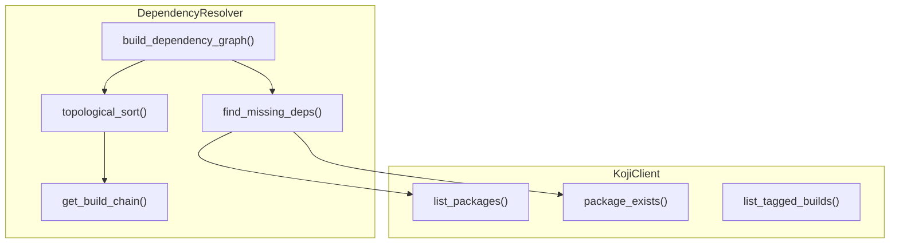

**Ключевые классы:**

- `KojiClient` -- клиент для взаимодействия с Koji через CLI. Методы: `list_packages()`, `package_exists()`, `list_tagged_builds()`, `search_package()`
- `DependencyNode` -- узел графа зависимостей (имя, путь к SRPM, список зависимостей, флаг доступности, порядок сборки)
- `DependencyResolver` -- основной класс разрешения зависимостей

**Алгоритм построения графа (build_dependency_graph):**

1. Начинает с корневого пакета
2. Для каждого пакета:
   - Если пакет уже есть в Koji -- помечает как `is_available = True`
   - Иначе: извлекает BuildRequires, находит недостающие, рекурсивно обрабатывает каждую зависимость
3. Строит направленный ациклический граф (DAG)

**Топологическая сортировка (алгоритм Кана):**

1. Вычисляет входящую степень (in-degree) для каждого узла
2. Добавляет узлы с in-degree = 0 в очередь
3. Извлекает узлы из очереди, уменьшая in-degree зависимых узлов
4. Обнаруживает циклические зависимости (если не все узлы обработаны)

**Группировка по уровням (get_build_chain):**

1. Пакеты без зависимостей -- уровень 0
2. Уровень пакета = max(уровень зависимостей) + 1
3. Пакеты одного уровня могут собираться параллельно

---

### 4. Fetcher -- скачивание SRPM

**Файл:** `vibebuild/fetcher.py`

**Ответственность:** загрузка SRPM-пакетов из внешних источников.

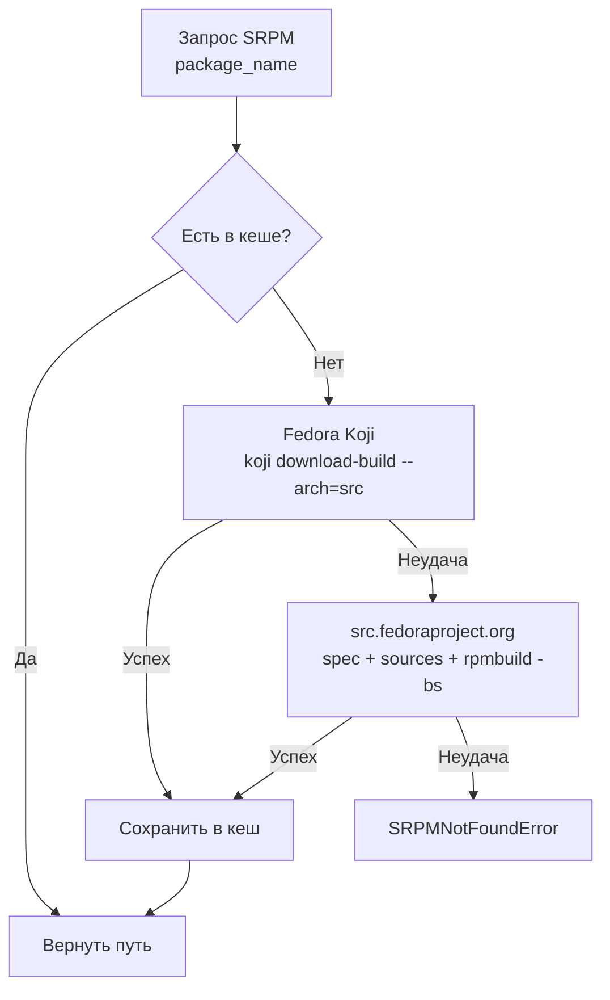

**Источники SRPM (в порядке приоритета):**

| Приоритет | Источник | Метод |
|---|---|---|
| 1 | Fedora Koji | `koji download-build --arch=src` -- скачивание готового SRPM |
| 2 | src.fedoraproject.org | Скачивание spec + sources, локальная сборка через `rpmbuild -bs` |

**Ключевой класс:**

- `SRPMFetcher` -- загрузчик SRPM. Поддерживает кеширование, настраиваемые источники, опциональное отключение SSL-верификации
- `SRPMSource` -- конфигурация источника SRPM (имя, URL, приоритет)

---

### 5. Builder -- оркестрация сборки

**Файл:** `vibebuild/builder.py`

**Ответственность:** управление процессом сборки в Koji, включая автоматическое разрешение зависимостей.

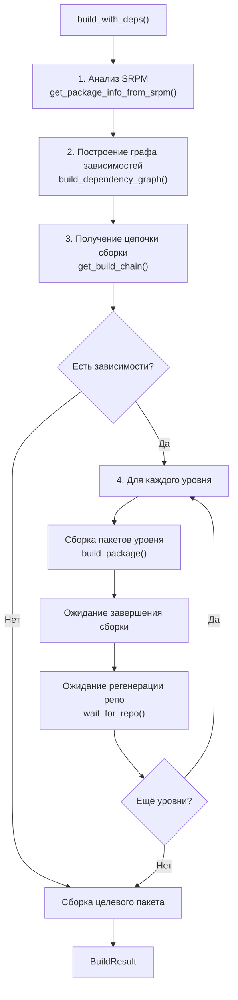

**Ключевые классы:**

- `KojiBuilder` -- основной класс-оркестратор. Содержит Resolver, Fetcher и логику взаимодействия с Koji
- `BuildTask` -- информация о задаче сборки (имя пакета, путь к SRPM, task_id, статус)
- `BuildResult` -- результат операции (успех/неудача, список задач, собранные/упавшие пакеты, время)
- `BuildStatus` -- enum статусов (PENDING, BUILDING, COMPLETE, FAILED, CANCELED)

**Метод `build_with_deps()` -- главная функция VibeBuild:**

1. Парсит SRPM, извлекает информацию о пакете
2. Строит полный граф зависимостей (рекурсивно скачивая SRPM для недостающих)
3. Получает цепочку сборки (пакеты сгруппированные по уровням)
4. Для каждого уровня:
   - Собирает все пакеты уровня (`koji build`)
   - Ждет завершения сборки
   - Ждет регенерации репозитория (`koji wait-repo`)
5. Собирает целевой пакет
6. Возвращает `BuildResult` с полной информацией

---

## Разрешение имён пакетов

### Проблема

Spec-файлы RPM-пакетов часто содержат имена зависимостей, которые не соответствуют реальным именам пакетов в репозитории. Это приводит к тому, что стандартный поиск в Koji не находит пакет.

**Типичные проблемные случаи:**

| В spec-файле | Что это | Реальное имя RPM | Имя SRPM |
|---|---|---|---|
| `python3dist(requests)` | Виртуальный provide Python | `python3-requests` | `python-requests` |
| `python3dist(setuptools)` | Виртуальный provide Python | `python3-setuptools` | `python-setuptools` |
| `%{python3_pkgversion}-devel` | Нераскрытый макрос RPM | `python3-devel` | `python3` |
| `pkgconfig(glib-2.0)` | pkg-config provide | `glib-2.0-devel` | `glib-2.0` |
| `perl(File::Path)` | Perl модуль | `perl-File-Path` | `perl-File-Path` |
| `cmake(Qt5Core)` | CMake модуль | `cmake-qt5core` | -- |
| `npm(typescript)` | npm пакет | `nodejs-typescript` | `nodejs-typescript` |
| `rubygem(bundler)` | Ruby gem | `rubygem-bundler` | `rubygem-bundler` |
| `golang(github.com/foo/bar)` | Go модуль | `golang-github.com-foo-bar` | `golang-github.com-foo-bar` |
| `mvn(org.apache:commons-lang)` | Maven артефакт | `commons-lang` | `commons-lang` |

### Rule-based разрешение

`PackageNameResolver` (`vibebuild/name_resolver.py`) реализует трёхступенчатый пайплайн:

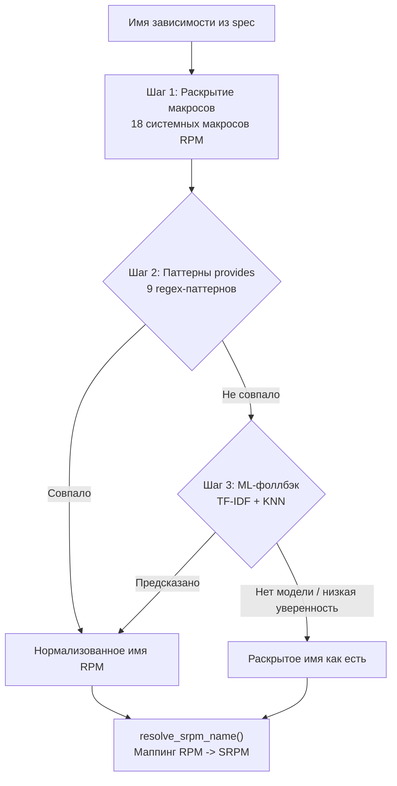

**Раскрытие макросов** -- таблица `SYSTEM_MACROS` содержит 18 известных системных макросов RPM:
- `%{python3_pkgversion}` -> `3`
- `%{python3_version}` -> `3.12`
- `%{_bindir}` -> `/usr/bin`
- `%{_libdir}` -> `/usr/lib64`
- и другие

**Паттерны виртуальных provides** -- 9 скомпилированных regex-паттернов с функциями-трансформерами:
- `python(\d*)dist(...)` -> `python{N}-{name}`
- `pkgconfig(...)` -> `{name}-devel`
- `perl(...)` -> `perl-{name}` (с заменой `::` на `-`)
- `rubygem(...)`, `npm(...)`, `cmake(...)`, `tex(...)`, `golang(...)`, `mvn(...)`

**Маппинг RPM -> SRPM** -- метод `resolve_srpm_name()` генерирует варианты SRPM-имён:
- `python3-requests` -> `["python-requests", "python3-requests"]`
- `glib2-devel` -> `["glib2", "glib2-devel"]`
- `perl-File-Path` -> `["perl-File-Path"]`

### ML-компонент

Когда rule-based паттерны не справляются (неизвестный виртуальный provide), включается ML-фоллбэк.

**Модуль:** `vibebuild/ml_resolver.py`

**Архитектура модели:**

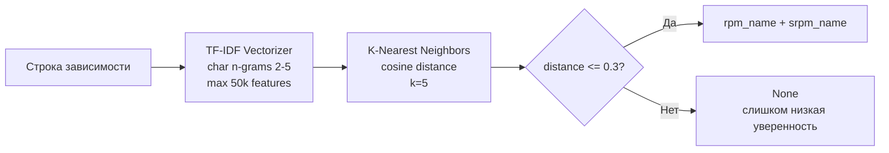

**Обучение:**

1. **Сбор данных** (`scripts/collect_training_data.py`): парсинг `primary.xml.gz` из репозиториев Fedora, извлечение маппингов provides -> package name (~50,000-100,000 записей)
2. **Обучение** (`scripts/train_model.py`): TF-IDF + KNN, оценка на тестовой выборке
3. **Модель** сохраняется в `vibebuild/data/model.joblib` (~5-15 MB)

```bash
# Полный цикл обучения
python scripts/collect_training_data.py --output data/training_data.json --release 40
python scripts/train_model.py --input data/training_data.json --output vibebuild/data/model.joblib
```

**Кеширование:** предсказания ML кешируются в `~/.cache/vibebuild/ml_name_cache.json` для повторного использования.

**Опциональность:** ML-компонент требует `scikit-learn` (`pip install vibebuild[ml]`). Без него VibeBuild работает с rule-based разрешением. ML молча отключается, если не установлен.

---

## Полный цикл работы vibebuild

```mermaid
flowchart TB
    Start(["vibebuild fedora-target my-pkg.src.rpm"]) --> ParseArgs["Парсинг аргументов CLI"]
    ParseArgs --> CreateBuilder["Создание KojiBuilder<br/>с KojiClient, Resolver, Fetcher"]
    CreateBuilder --> AnalyzeSRPM["Анализ SRPM<br/>rpm2cpio + парсинг .spec"]
    AnalyzeSRPM --> ExtractBR["Извлечение BuildRequires"]
    ExtractBR --> CheckKoji{"Проверка каждой<br/>зависимости в Koji"}

    CheckKoji -->|"Все доступны"| DirectBuild["Прямая сборка пакета"]
    CheckKoji -->|"Есть недостающие"| DownloadSRPM["Скачивание SRPM<br/>из Fedora Koji / src.fporg"]
    DownloadSRPM --> RecursiveCheck["Рекурсивная проверка<br/>зависимостей зависимостей"]
    RecursiveCheck --> BuildDAG["Построение DAG"]
    BuildDAG --> TopoSort["Топологическая сортировка<br/>Алгоритм Кана"]
    TopoSort --> GroupLevels["Группировка по уровням"]

    GroupLevels --> Level0["Уровень 0: пакеты без зависимостей"]
    Level0 --> KojiBuild0["koji build для каждого"]
    KojiBuild0 --> WaitRepo0["koji wait-repo"]

    WaitRepo0 --> Level1["Уровень 1: зависят от уровня 0"]
    Level1 --> KojiBuild1["koji build для каждого"]
    KojiBuild1 --> WaitRepo1["koji wait-repo"]

    WaitRepo1 --> LevelN["...Уровень N..."]
    LevelN --> DirectBuild

    DirectBuild --> KojiBuildFinal["koji build целевого пакета"]
    KojiBuildFinal --> MockBuild["Mock chroot: сборка SRPM -> RPM"]
    MockBuild --> TagPackage["Тегирование пакета в fedora-dest"]
    TagPackage --> RegenRepo["Регенерация репозитория"]
    RegenRepo --> Done(["Готовые RPM-пакеты<br/>в /mnt/koji/packages/"])
```

---

## Диаграмма последовательности

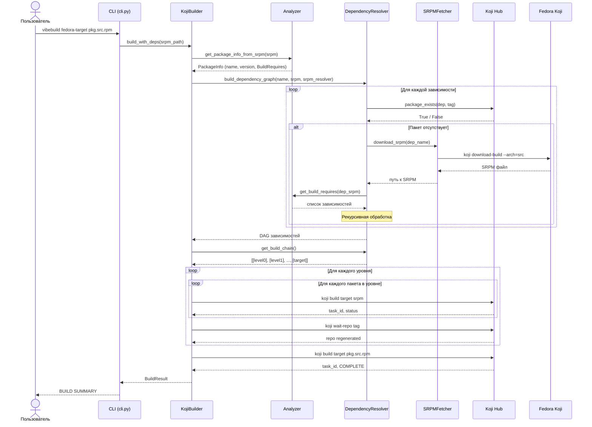

---

## Разрешение зависимостей и DAG

### Пример графа зависимостей

Допустим, мы собираем пакет `my-app`, который зависит от `lib-foo`, `lib-bar` и `lib-baz`. При этом `lib-foo` зависит от `lib-base`, а `lib-baz` -- от `lib-core`. Пакеты `lib-bar`, `lib-base` и `lib-core` уже есть в Koji.

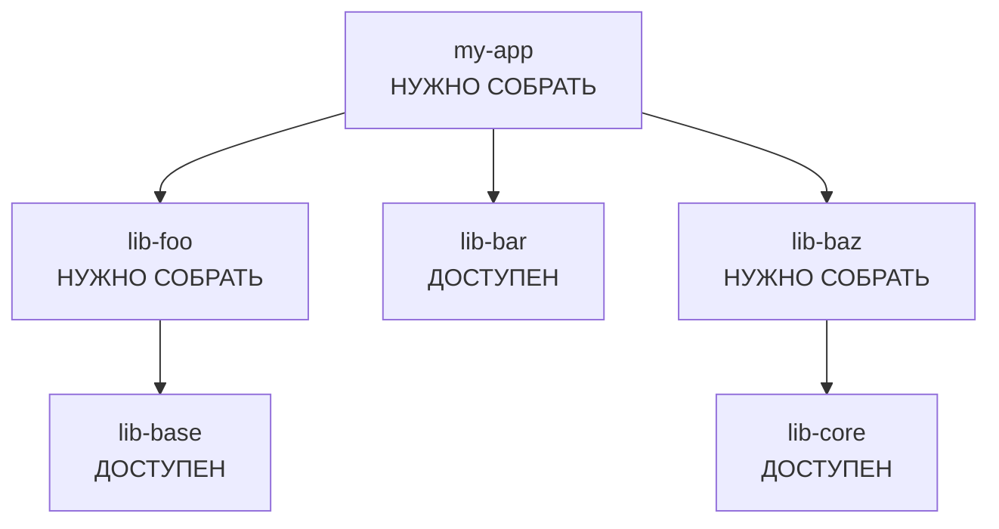

### Определение порядка сборки

После топологической сортировки и группировки по уровням:

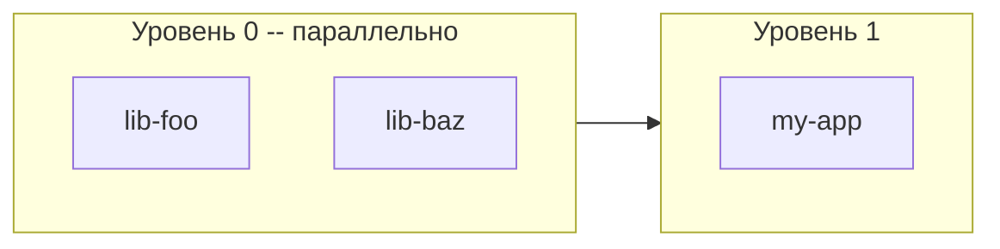

**Порядок сборки:**

1. **Уровень 0:** `lib-foo` и `lib-baz` собираются параллельно (их зависимости `lib-base` и `lib-core` уже доступны)
2. `koji wait-repo` -- ожидание регенерации репозитория
3. **Уровень 1:** `my-app` собирается после того, как все зависимости доступны

---

## Сравнение koji build и koji vibebuild

```mermaid
graph TB
    subgraph standard ["koji build (стандартный)"]
        S_Start(["koji build target pkg.src.rpm"]) --> S_Check{"Все BuildRequires<br/>доступны?"}
        S_Check -->|Да| S_Build["Сборка в mock"]
        S_Check -->|Нет| S_Fail(["ОШИБКА:<br/>Missing dependency"])
        S_Build --> S_Done(["RPM готов"])
    end

    subgraph vibe ["vibebuild (расширенный)"]
        V_Start(["vibebuild target pkg.src.rpm"]) --> V_Analyze["Анализ зависимостей"]
        V_Analyze --> V_Check{"Все BuildRequires<br/>доступны?"}
        V_Check -->|Да| V_Build["Сборка в mock"]
        V_Check -->|Нет| V_Download["Скачивание SRPM<br/>недостающих зависимостей"]
        V_Download --> V_Recursive["Рекурсивный анализ<br/>зависимостей зависимостей"]
        V_Recursive --> V_DAG["Построение DAG"]
        V_DAG --> V_BuildDeps["Сборка зависимостей<br/>по уровням"]
        V_BuildDeps --> V_WaitRepo["wait-repo между уровнями"]
        V_WaitRepo --> V_Build
        V_Build --> V_Done(["RPM готов"])
    end
```

**Ключевое отличие:** стандартный `koji build` падает при отсутствии зависимостей, а `vibebuild` автоматически скачивает и собирает их.

---

## Теги и таргеты Koji

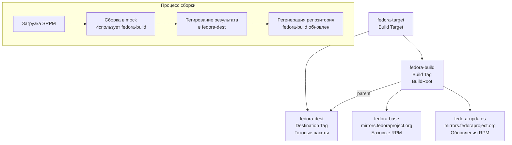

**Как работают теги:**

- **fedora-build** (Build Tag) -- определяет buildroot (среду сборки). Включает пакеты из fedora-dest (через parent) и внешние репозитории Fedora
- **fedora-dest** (Destination Tag) -- хранилище готовых собранных пакетов
- **fedora-target** -- связывает build tag и destination tag

При сборке:
1. SRPM загружается в Koji
2. Mock создает chroot из пакетов fedora-build
3. Пакет собирается в изолированном окружении
4. Результат тегируется в fedora-dest
5. Репозиторий fedora-build регенерируется (включает новый пакет)

---

## Иерархия ошибок

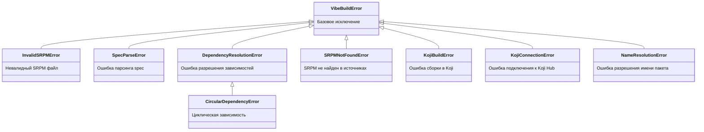

---

## Структура проекта

```
koji-vibebuild/
├── vibebuild/                  # Основной Python-пакет
│   ├── __init__.py             # Экспорт классов
│   ├── analyzer.py             # Парсинг SRPM/spec, извлечение BuildRequires
│   ├── builder.py              # Оркестрация сборки в Koji
│   ├── cli.py                  # CLI-интерфейс (точка входа)
│   ├── exceptions.py           # Иерархия исключений (+ NameResolutionError)
│   ├── fetcher.py              # Скачивание SRPM из Fedora
│   ├── name_resolver.py        # Разрешение имён пакетов (правила + ML-обертка)
│   ├── ml_resolver.py          # ML-модель (TF-IDF + KNN, scikit-learn)
│   ├── resolver.py             # Разрешение зависимостей, построение DAG
│   └── data/                   # Данные ML-модели
│       ├── .gitkeep
│       └── model.joblib        # Предобученная модель (после обучения)
│
├── scripts/                    # Скрипты для ML
│   ├── collect_training_data.py # Сбор данных из Fedora (primary.xml)
│   └── train_model.py          # Обучение ML-модели
│
├── tests/                      # Тесты
│   ├── conftest.py             # Фикстуры pytest
│   ├── test_analyzer.py        # Тесты анализатора
│   ├── test_builder.py         # Тесты билдера
│   ├── test_cli.py             # Тесты CLI
│   ├── test_fetcher.py         # Тесты загрузчика
│   ├── test_resolver.py        # Тесты разрешения зависимостей
│   ├── test_name_resolver.py   # Тесты разрешения имён (49 тестов)
│   └── test_ml_resolver.py     # Тесты ML-модели (26 тестов)
│
├── ansible/                    # Ansible-автоматизация деплоя Koji
│   ├── playbook.yml            # Главный плейбук
│   ├── group_vars/all.yml      # Переменные (FQDN, БД, теги, репо)
│   ├── inventory/hosts.ini     # Инвентарь серверов
│   ├── requirements.yml        # Ansible-коллекции
│   └── roles/
│       ├── postgresql/         # Роль: PostgreSQL
│       ├── koji-hub/           # Роль: Koji Hub (Apache + mod_wsgi)
│       ├── koji-builder/       # Роль: Koji Builder (kojid + mock)
│       ├── koji-web/           # Роль: Koji Web UI
│       └── koji-init/          # Роль: инициализация (теги, таргеты, пользователи)
│
├── docs/                       # Документация
│   ├── PROJECT_OVERVIEW.md     # Полное описание проекта (этот файл)
│   ├── ARCHITECTURE.md         # Архитектура системы
│   ├── API.md                  # Справочник API
│   ├── DEPLOYMENT.md           # Руководство по деплою
│   ├── TESTING.md              # Руководство по тестированию
│   └── VPS_SETUP.md            # Руководство по созданию VPS-сервера
│
├── pyproject.toml              # Метаданные, optional deps: [ml] scikit-learn+joblib
├── setup.py                    # Setuptools
├── requirements.txt            # Зависимости (requests>=2.25.0)
├── requirements-dev.txt        # Dev-зависимости (pytest, black, mypy...)
├── .pre-commit-config.yaml     # Pre-commit хуки
├── .commitlintrc.yaml          # Линтинг commit-сообщений
├── LICENSE                     # MIT License
└── README.md                   # Обзор проекта
```

---

## Ansible-инфраструктура

Ansible-плейбук автоматизирует полный деплой Koji на сервер.

### Роли и порядок выполнения

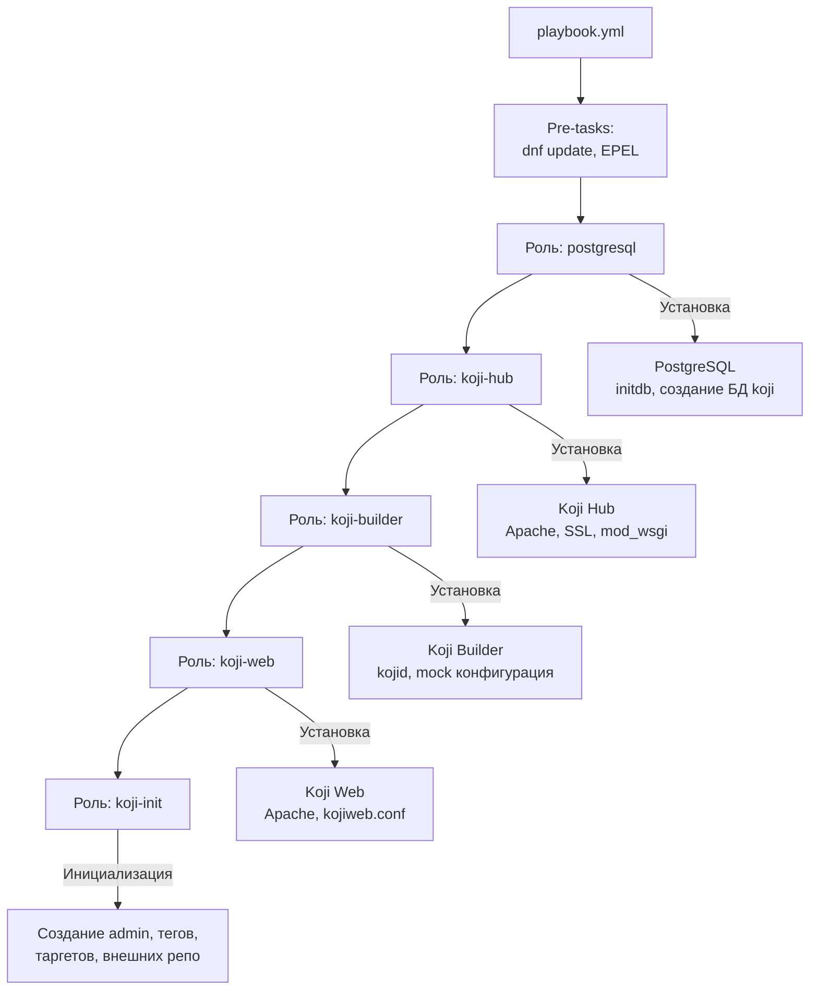

### Описание ролей

| Роль | Что делает |
|---|---|
| `postgresql` | Установка PostgreSQL, инициализация БД, создание пользователя `koji`, настройка `pg_hba.conf` |
| `koji-hub` | Установка `koji-hub`, генерация SSL-сертификатов (CA, сервер, admin), настройка Apache + mod_wsgi, конфигурация `hub.conf` |
| `koji-builder` | Установка `koji-builder`, `mock`, настройка `kojid.conf`, mock chroot `fedora-40-x86_64` |
| `koji-web` | Установка `koji-web`, настройка Apache vhost для веб-интерфейса |
| `koji-init` | Добавление admin-пользователя, создание тегов `fedora-dest` и `fedora-build`, создание таргета `fedora-target`, подключение внешних репозиториев Fedora |

### Ключевые переменные (group_vars/all.yml)

| Переменная | Описание | Пример |
|---|---|---|
| `koji_hub_fqdn` | FQDN сервера Koji | `koji.example.com` |
| `postgresql_password` | Пароль БД | `changeme` |
| `koji_admin_user` | Имя администратора | `kojiadmin` |
| `koji_build_tag` | Build tag | `fedora-build` |
| `koji_dest_tag` | Destination tag | `fedora-dest` |
| `koji_target` | Build target | `fedora-target` |
| `mock_chroot` | Конфигурация mock | `fedora-40-x86_64` |
| `external_repos` | Внешние репозитории | Fedora base + updates |

---

## CLI -- командный интерфейс

### Основные команды

```bash
# Сборка с автоматическим разрешением зависимостей
vibebuild fedora-target my-package-1.0-1.fc40.src.rpm

# Scratch-сборка (без тегирования)
vibebuild --scratch fedora-target my-package.src.rpm

# Анализ зависимостей без сборки
vibebuild --analyze-only my-package.src.rpm

# Скачивание SRPM из Fedora
vibebuild --download-only python-requests

# Dry run -- показать план сборки
vibebuild --dry-run fedora-target my-package.src.rpm

# Сборка без разрешения зависимостей (аналог koji build)
vibebuild --no-deps fedora-target my-package.src.rpm

# Отключить ML-разрешение имён (только правила)
vibebuild --no-ml fedora-target my-package.src.rpm

# Отключить всю нормализацию имён
vibebuild --no-name-resolution fedora-target my-package.src.rpm

# Использовать свою ML-модель
vibebuild --ml-model /path/to/model.joblib fedora-target my-package.src.rpm
```

### Опции Koji-сервера

```bash
vibebuild \
    --server https://koji.example.com/kojihub \
    --web-url https://koji.example.com/koji \
    --cert ~/.koji/client.pem \
    --serverca ~/.koji/serverca.crt \
    --build-tag fedora-build \
    fedora-target my-package.src.rpm
```

### Режимы работы

| Режим | Флаг | Описание |
|---|---|---|
| Полная сборка | _(по умолчанию)_ | Анализ + разрешение зависимостей + сборка всего |
| Без зависимостей | `--no-deps` | Аналог стандартного `koji build` |
| Только анализ | `--analyze-only` | Показать зависимости и их доступность |
| Только скачивание | `--download-only` | Скачать SRPM из Fedora |
| Сухой запуск | `--dry-run` | Показать план без реальной сборки |
| Scratch | `--scratch` | Сборка без тегирования результата |

### Опции разрешения имён

| Флаг | Описание |
|---|---|
| `--no-name-resolution` | Отключить всю нормализацию имён (макросы, виртуальные provides, ML) |
| `--no-ml` | Отключить ML-фоллбэк (оставить только rule-based разрешение) |
| `--ml-model PATH` | Путь к своей ML-модели (по умолчанию: встроенная `vibebuild/data/model.joblib`) |
