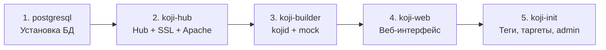
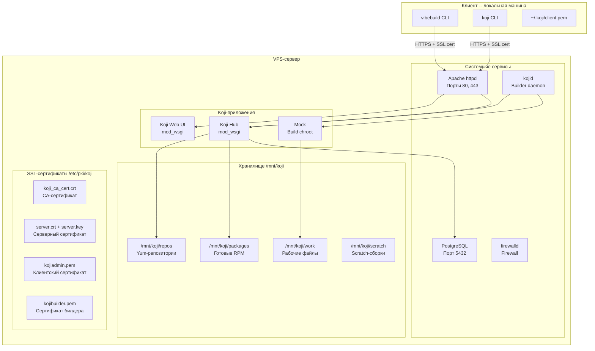

# Руководство по созданию VPS-сервера для Koji

Пошаговая инструкция по созданию и настройке VPS-сервера для развертывания системы сборки Koji и использования VibeBuild.

## Содержание

- [Требования к серверу](#требования-к-серверу)
- [Шаг 1: Выбор и заказ VPS](#шаг-1-выбор-и-заказ-vps)
- [Шаг 2: Первоначальная настройка сервера](#шаг-2-первоначальная-настройка-сервера)
- [Шаг 3: Установка Koji через Ansible (рекомендуется)](#шаг-3-установка-koji-через-ansible-рекомендуется)
- [Шаг 4: Ручная установка Koji (альтернативный способ)](#шаг-4-ручная-установка-koji-альтернативный-способ)
- [Шаг 5: Настройка клиента VibeBuild](#шаг-5-настройка-клиента-vibebuild)
- [Шаг 6: Проверка работоспособности](#шаг-6-проверка-работоспособности)
- [Диаграмма компонентов VPS](#диаграмма-компонентов-vps)
- [Решение проблем](#решение-проблем)

---

## Требования к серверу

### Минимальные требования

| Параметр | Минимум | Рекомендуется |
|---|---|---|
| **ОС** | Fedora 40+ | Fedora 41 Server |
| **RAM** | 4 GB | 8 GB+ |
| **CPU** | 2 ядра | 4 ядра+ |
| **Диск** | 50 GB SSD | 100 GB+ SSD |
| **Сеть** | Публичный IP | Публичный IP + домен |
| **Порты** | 80, 443 | 80, 443, 5432 |

### Почему Fedora?

Koji разрабатывается в рамках проекта Fedora и лучше всего поддерживается на Fedora. Все пакеты (`koji-hub`, `koji-builder`, `koji-web`) доступны в стандартных репозиториях.

---

## Шаг 1: Выбор и заказ VPS

### Рекомендуемые провайдеры

| Провайдер | Плюсы | Минусы |
|---|---|---|
| **Timeweb** | Русскоязычная поддержка, серверы в РФ | Ограниченный выбор ОС |
| **Selectel** | Серверы в РФ, гибкая конфигурация | Цена |
| **Hetzner** | Низкая цена, мощное железо | Серверы в ЕС |
| **DigitalOcean** | Простой интерфейс, Fedora образы | Серверы за рубежом |
| **Vultr** | Fedora образы, много локаций | Серверы за рубежом |

### При заказе VPS

1. Выберите образ **Fedora 40+** (Server Edition)
2. Выберите тариф с минимум **4 GB RAM** и **50 GB SSD**
3. Выберите регион, ближайший к вам
4. Настройте SSH-ключ для доступа (рекомендуется)
5. Запишите **IP-адрес** сервера

---

## Шаг 2: Первоначальная настройка сервера

### 2.1 Подключение к серверу

```bash
ssh root@YOUR_VPS_IP
```

### 2.2 Обновление системы

```bash
dnf update -y
dnf install -y vim wget curl git
```

### 2.3 Настройка hostname

```bash
# Установите FQDN (замените на ваш домен или IP)
hostnamectl set-hostname koji.example.com

# Добавьте в /etc/hosts
echo "YOUR_VPS_IP koji.example.com koji" >> /etc/hosts
```

### 2.4 Создание пользователя (рекомендуется)

```bash
# Создать пользователя
useradd -m -G wheel kojiadmin
passwd kojiadmin

# Разрешить sudo без пароля (опционально)
echo "kojiadmin ALL=(ALL) NOPASSWD:ALL" > /etc/sudoers.d/kojiadmin
```

### 2.5 Настройка SSH

```bash
# На локальной машине: скопировать SSH-ключ
ssh-copy-id kojiadmin@YOUR_VPS_IP

# На сервере: отключить вход по паролю (опционально)
sed -i 's/^PasswordAuthentication yes/PasswordAuthentication no/' /etc/ssh/sshd_config
systemctl restart sshd
```

### 2.6 Настройка firewall

```bash
# Проверить статус
systemctl status firewalld

# Если не запущен
systemctl enable --now firewalld

# Открыть необходимые порты
firewall-cmd --permanent --add-service=http
firewall-cmd --permanent --add-service=https
firewall-cmd --permanent --add-port=5432/tcp
firewall-cmd --reload

# Проверить
firewall-cmd --list-all
```

### 2.7 Настройка SELinux (если включен)

```bash
# Проверить статус
getenforce

# Разрешить Apache доступ к сети
setsebool -P httpd_can_network_connect 1
setsebool -P httpd_can_network_connect_db 1
```

---

## Шаг 3: Установка Koji через Ansible (рекомендуется)

Автоматический способ -- используется Ansible-плейбук из репозитория проекта.

### 3.1 Установка Ansible (на локальной машине)

```bash
# Fedora / RHEL
sudo dnf install -y ansible-core

# macOS
brew install ansible

# Ubuntu / Debian
sudo apt install -y ansible

# Или через pip
pip install ansible
```

### 3.2 Клонирование репозитория

```bash
git clone https://github.com/vibebuild/vibebuild.git
cd vibebuild/ansible
```

### 3.3 Установка Ansible-коллекций

```bash
ansible-galaxy install -r requirements.yml
```

Файл `requirements.yml` содержит:
- `ansible.posix` -- для работы с системными настройками
- `community.postgresql` -- для PostgreSQL
- `community.general` -- общие модули

### 3.4 Настройка инвентаря

Отредактируйте файл `inventory/hosts.ini`:

```ini
[koji_hub]
koji-server ansible_host=YOUR_VPS_IP ansible_user=root

[koji_builders]
koji-server

[koji_web]
koji-server

[koji:children]
koji_hub
koji_builders
koji_web
```

Замените `YOUR_VPS_IP` на IP-адрес вашего VPS.

### 3.5 Настройка переменных

Отредактируйте файл `group_vars/all.yml`:

```yaml
# ОБЯЗАТЕЛЬНО измените:
koji_hub_fqdn: "koji.example.com"          # Ваш домен или IP
postgresql_password: "SecurePassword123"     # Надежный пароль для БД
koji_admin_user: "kojiadmin"                 # Имя администратора

# SSL-сертификаты:
ssl_cert_country: "RU"
ssl_cert_state: "Moscow"
ssl_cert_city: "Moscow"
ssl_cert_org: "VibeBuild"
ssl_cert_ou: "Build System"

# Теги и таргеты (можно оставить по умолчанию):
koji_build_tag: "fedora-build"
koji_dest_tag: "fedora-dest"
koji_target: "fedora-target"

# Внешние репозитории:
external_repos:
  - name: "fedora-base"
    url: "https://mirrors.fedoraproject.org/mirrorlist?repo=fedora-$releasever&arch=$basearch"
  - name: "fedora-updates"
    url: "https://mirrors.fedoraproject.org/mirrorlist?repo=updates-released-f$releasever&arch=$basearch"

# Mock конфигурация:
mock_chroot: "fedora-40-x86_64"

# Firewall порты:
firewall_ports:
  - 80/tcp
  - 443/tcp
  - 5432/tcp
```

### 3.6 Проверка подключения

```bash
ansible all -i inventory/hosts.ini -m ping
```

Ожидаемый вывод:

```
koji-server | SUCCESS => {
    "ping": "pong"
}
```

### 3.7 Запуск плейбука

```bash
ansible-playbook -i inventory/hosts.ini playbook.yml
```

Плейбук выполнит следующие роли в порядке:



Процесс занимает 5-15 минут в зависимости от скорости сервера и сети.

### 3.8 Проверка результата

После завершения плейбук выведет URL:

```
TASK [Display Koji Web URL]
ok: [koji-server] => {
    "msg": "Koji Web UI available at: https://koji.example.com/koji"
}
```

Откройте в браузере: `https://YOUR_VPS_IP/koji`

---

## Шаг 4: Ручная установка Koji (альтернативный способ)

Если вы предпочитаете ручную установку или хотите понять, что делает Ansible.

### 4.1 Установка пакетов

```bash
dnf install -y \
    koji-hub \
    koji-hub-plugins \
    koji-builder \
    koji-web \
    postgresql-server \
    httpd \
    mod_ssl \
    mod_wsgi \
    python3-koji \
    mock \
    rpm-build \
    createrepo_c
```

### 4.2 Настройка PostgreSQL

```bash
# Инициализация БД
postgresql-setup --initdb

# Запуск
systemctl enable --now postgresql

# Настройка pg_hba.conf -- разрешить доступ для Koji
cat >> /var/lib/pgsql/data/pg_hba.conf << 'EOF'
host    koji        koji        127.0.0.1/32    md5
host    koji        koji        ::1/128         md5
EOF

# Перезапуск PostgreSQL
systemctl restart postgresql

# Создание пользователя и БД
sudo -u postgres psql << 'EOF'
CREATE USER koji WITH PASSWORD 'your_secure_password';
CREATE DATABASE koji OWNER koji;
EOF

# Импорт схемы Koji
sudo -u postgres psql koji < /usr/share/doc/koji*/docs/schema.sql
```

### 4.3 Генерация SSL-сертификатов

```bash
# Создание директорий
mkdir -p /etc/pki/koji/{certs,private}

# Генерация CA-сертификата
openssl req -new -x509 -days 3650 -nodes \
    -subj "/C=RU/ST=Moscow/L=Moscow/O=VibeBuild/OU=Build System/CN=Koji CA" \
    -keyout /etc/pki/koji/koji_ca_cert.key \
    -out /etc/pki/koji/koji_ca_cert.crt

# Генерация серверного сертификата
openssl genrsa -out /etc/pki/koji/certs/server.key 2048
openssl req -new \
    -subj "/CN=koji.example.com" \
    -key /etc/pki/koji/certs/server.key \
    -out /etc/pki/koji/certs/server.csr
openssl x509 -req -days 3650 \
    -in /etc/pki/koji/certs/server.csr \
    -CA /etc/pki/koji/koji_ca_cert.crt \
    -CAkey /etc/pki/koji/koji_ca_cert.key \
    -CAcreateserial \
    -out /etc/pki/koji/certs/server.crt

# Генерация клиентского сертификата (admin)
openssl genrsa -out /etc/pki/koji/certs/kojiadmin.key 2048
openssl req -new \
    -subj "/CN=kojiadmin" \
    -key /etc/pki/koji/certs/kojiadmin.key \
    -out /etc/pki/koji/certs/kojiadmin.csr
openssl x509 -req -days 3650 \
    -in /etc/pki/koji/certs/kojiadmin.csr \
    -CA /etc/pki/koji/koji_ca_cert.crt \
    -CAkey /etc/pki/koji/koji_ca_cert.key \
    -out /etc/pki/koji/certs/kojiadmin.crt

# Создание PEM-бандла для клиента
cat /etc/pki/koji/certs/kojiadmin.crt /etc/pki/koji/certs/kojiadmin.key > /etc/pki/koji/kojiadmin.pem

# Генерация сертификата для билдера
openssl genrsa -out /etc/pki/koji/certs/kojibuilder.key 2048
openssl req -new \
    -subj "/CN=$(hostname)" \
    -key /etc/pki/koji/certs/kojibuilder.key \
    -out /etc/pki/koji/certs/kojibuilder.csr
openssl x509 -req -days 3650 \
    -in /etc/pki/koji/certs/kojibuilder.csr \
    -CA /etc/pki/koji/koji_ca_cert.crt \
    -CAkey /etc/pki/koji/koji_ca_cert.key \
    -out /etc/pki/koji/certs/kojibuilder.crt
cat /etc/pki/koji/certs/kojibuilder.crt /etc/pki/koji/certs/kojibuilder.key > /etc/pki/koji/kojibuilder.pem
```

### 4.4 Создание директорий Koji

```bash
mkdir -p /mnt/koji/{packages,repos,work,scratch}
chown -R apache:apache /mnt/koji
```

### 4.5 Настройка Koji Hub

```bash
cat > /etc/koji-hub/hub.conf << 'EOF'
[hub]
DBName = koji
DBUser = koji
DBPass = your_secure_password
DBHost = 127.0.0.1
KojiDir = /mnt/koji
AuthPrincipal =
ProxyPrincipals =
LoginCreatesUser = On
KojiWebURL = https://koji.example.com/koji
DisableNotifications = True
EOF
```

### 4.6 Настройка Apache

Создайте файл `/etc/httpd/conf.d/kojihub.conf`:

```apache
Alias /kojihub /usr/share/koji-hub/kojiapp.py

<Directory "/usr/share/koji-hub">
    Options ExecCGI
    SetHandler wsgi-script
    WSGIApplicationGroup %{GLOBAL}
    Require all granted
</Directory>

Alias /kojifiles /mnt/koji

<Directory "/mnt/koji">
    Options Indexes FollowSymLinks
    AllowOverride None
    Require all granted
</Directory>
```

Настройте SSL в `/etc/httpd/conf.d/ssl.conf`:

```apache
SSLCertificateFile /etc/pki/koji/certs/server.crt
SSLCertificateKeyFile /etc/pki/koji/certs/server.key
SSLCACertificateFile /etc/pki/koji/koji_ca_cert.crt
SSLVerifyClient optional
SSLVerifyDepth 10
```

### 4.7 Настройка Koji Builder

```bash
cat > /etc/kojid/kojid.conf << 'EOF'
[kojid]
server = https://koji.example.com/kojihub
topurl = https://koji.example.com/kojifiles
workdir = /tmp/koji
cert = /etc/pki/koji/kojibuilder.pem
serverca = /etc/pki/koji/koji_ca_cert.crt
allowed_scms = src.fedoraproject.org:/*:no:fedpkg,sources
mockdir = /var/lib/mock
mockuser = kojibuilder
mockhost = fedora-40-x86_64
EOF
```

### 4.8 Настройка Koji Web

```bash
cat > /etc/kojiweb/web.conf << 'EOF'
[web]
SiteName = Koji
KojiHubURL = https://koji.example.com/kojihub
KojiFilesURL = https://koji.example.com/kojifiles
WebCert = /etc/pki/koji/kojiadmin.pem
ClientCA = /etc/pki/koji/koji_ca_cert.crt
KojiHubCA = /etc/pki/koji/koji_ca_cert.crt
LoginTimeout = 72
Secret = CHANGE_THIS_TO_RANDOM_STRING
EOF
```

### 4.9 Запуск сервисов

```bash
systemctl enable --now httpd
systemctl enable --now kojid
```

### 4.10 Инициализация Koji

```bash
# Настройка клиента на сервере
mkdir -p ~/.koji
cp /etc/pki/koji/kojiadmin.pem ~/.koji/client.pem
cp /etc/pki/koji/koji_ca_cert.crt ~/.koji/serverca.crt

cat > ~/.koji/config << 'EOF'
[koji]
server = https://koji.example.com/kojihub
weburl = https://koji.example.com/koji
topurl = https://koji.example.com/kojifiles
cert = ~/.koji/client.pem
serverca = ~/.koji/serverca.crt
EOF

# Добавление администратора
koji add-user kojiadmin
koji grant-permission admin kojiadmin

# Добавление хоста-билдера
koji add-host $(hostname) x86_64

# Создание тегов
koji add-tag fedora-dest
koji add-tag fedora-build --parent fedora-dest --arches x86_64

# Создание таргета
koji add-target fedora-target fedora-build fedora-dest

# Подключение внешних репозиториев Fedora
koji add-external-repo -t fedora-build fedora-base \
    "https://mirrors.fedoraproject.org/mirrorlist?repo=fedora-\$releasever&arch=\$basearch"
koji add-external-repo -t fedora-build fedora-updates \
    "https://mirrors.fedoraproject.org/mirrorlist?repo=updates-released-f\$releasever&arch=\$basearch"

# Создание групп сборки
koji add-group fedora-build build
koji add-group fedora-build srpm-build

# Добавление пакетов в группу build
for pkg in bash bzip2 coreutils cpio diffutils fedora-release findutils \
    gawk glibc-minimal-langpack grep gzip info make patch \
    redhat-rpm-config rpm-build sed shadow-utils tar unzip \
    util-linux which xz; do
    koji add-group-pkg fedora-build build $pkg
done

# Добавление пакетов в группу srpm-build
for pkg in bash fedora-release fedpkg-minimal gnupg2 \
    redhat-rpm-config rpm-build shadow-utils; do
    koji add-group-pkg fedora-build srpm-build $pkg
done

# Регенерация репозитория (занимает 5-15 минут)
koji regen-repo fedora-build
```

---

## Шаг 5: Настройка клиента VibeBuild

Выполняется на **локальной машине** (не на сервере).

### 5.1 Получение сертификатов

```bash
# Создание директории
mkdir -p ~/.koji

# Скопировать сертификаты с сервера
scp root@YOUR_VPS_IP:/etc/pki/koji/kojiadmin.pem ~/.koji/client.pem
scp root@YOUR_VPS_IP:/etc/pki/koji/koji_ca_cert.crt ~/.koji/serverca.crt
```

### 5.2 Настройка Koji CLI

```bash
cat > ~/.koji/config << 'EOF'
[koji]
server = https://YOUR_VPS_IP/kojihub
weburl = https://YOUR_VPS_IP/koji
topurl = https://YOUR_VPS_IP/kojifiles
cert = ~/.koji/client.pem
serverca = ~/.koji/serverca.crt
EOF
```

### 5.3 Установка VibeBuild

```bash
# Из PyPI
pip install vibebuild

# Или из исходников
git clone https://github.com/vibebuild/vibebuild.git
cd vibebuild
pip install -e .
```

### 5.4 Установка системных зависимостей

```bash
# Fedora / RHEL
sudo dnf install -y koji rpm-build rpm2cpio

# macOS (через Homebrew)
brew install rpm

# Ubuntu / Debian
sudo apt install -y koji rpm rpm2cpio
```

### 5.5 Проверка подключения

```bash
# Проверка подключения к Koji
koji hello

# Ожидаемый вывод:
# olá, kojiadmin!
# You are using the hub at https://YOUR_VPS_IP/kojihub
```

---

## Шаг 6: Проверка работоспособности

### 6.1 Проверка веб-интерфейса

Откройте в браузере: `https://YOUR_VPS_IP/koji`

Вы должны увидеть веб-интерфейс Koji с информацией о системе.

### 6.2 Проверка статуса сервисов

```bash
# На сервере
systemctl status httpd          # Apache (Koji Hub + Web)
systemctl status kojid          # Koji Builder
systemctl status postgresql     # PostgreSQL

# Проверка хостов
koji list-hosts

# Проверка тегов
koji list-tags

# Проверка таргетов
koji list-targets
```

### 6.3 Тестовая сборка с VibeBuild

```bash
# Скачать тестовый SRPM из Fedora
vibebuild --download-only python-six

# Анализ зависимостей
vibebuild --analyze-only python-six-*.src.rpm

# Dry run -- показать план сборки
vibebuild --dry-run \
    --server https://YOUR_VPS_IP/kojihub \
    --cert ~/.koji/client.pem \
    --serverca ~/.koji/serverca.crt \
    fedora-target python-six-*.src.rpm

# Полная сборка
vibebuild \
    --server https://YOUR_VPS_IP/kojihub \
    --cert ~/.koji/client.pem \
    --serverca ~/.koji/serverca.crt \
    fedora-target python-six-*.src.rpm
```

---

## Диаграмма компонентов VPS



---

## Решение проблем

### Не могу подключиться к серверу

```bash
# Проверить, что Apache запущен
sudo systemctl status httpd

# Проверить порты
sudo ss -tlnp | grep -E ':(80|443)'

# Проверить firewall
sudo firewall-cmd --list-all

# Проверить SSL-сертификат
openssl s_client -connect YOUR_VPS_IP:443 < /dev/null

# Если используете самоподписанный сертификат, добавьте --no-ssl-verify
vibebuild --no-ssl-verify --server https://YOUR_VPS_IP/kojihub ...
```

### Ошибка "SSL certificate verify failed"

```bash
# Проверить, что serverca указан правильно
ls -la ~/.koji/serverca.crt

# Проверить, что client.pem содержит и сертификат и ключ
openssl x509 -in ~/.koji/client.pem -noout -subject
openssl rsa -in ~/.koji/client.pem -noout -check

# Если самоподписанный сертификат -- использовать флаг
vibebuild --no-ssl-verify ...
```

### Ошибка "Database connection failed"

```bash
# На сервере: проверить PostgreSQL
sudo systemctl status postgresql

# Проверить подключение
psql -h 127.0.0.1 -U koji -d koji

# Проверить pg_hba.conf
sudo cat /var/lib/pgsql/data/pg_hba.conf | grep koji

# Перезапустить PostgreSQL
sudo systemctl restart postgresql
```

### Builder показывает "offline"

```bash
# Проверить kojid
sudo systemctl status kojid
sudo journalctl -u kojid -f

# Проверить сертификат билдера
ls -la /etc/pki/koji/kojibuilder.pem

# Проверить, что хост добавлен
koji list-hosts

# Перезапустить kojid
sudo systemctl restart kojid
```

### Сборка падает с ошибкой "createrepo error"

```bash
# Регенерировать репозиторий
koji regen-repo fedora-build

# Проверить права на /mnt/koji
sudo chown -R apache:apache /mnt/koji

# Проверить место на диске
df -h /mnt/koji
```

### Полезные логи

```bash
# Koji Hub (Apache)
sudo tail -f /var/log/httpd/error_log

# Koji Builder
sudo journalctl -u kojid -f

# PostgreSQL
sudo tail -f /var/lib/pgsql/data/log/postgresql-*.log

# Mock
sudo ls /var/lib/mock/*/result/
```

---

## Дополнительно

### Резервное копирование

Рекомендуется настроить регулярное резервное копирование:

```bash
# Дамп базы данных
pg_dump -U koji koji > /backup/koji_db_$(date +%Y%m%d).sql

# Копирование сертификатов
tar -czf /backup/koji_certs_$(date +%Y%m%d).tar.gz /etc/pki/koji/

# Копирование конфигурации
tar -czf /backup/koji_config_$(date +%Y%m%d).tar.gz \
    /etc/koji-hub/ /etc/kojid/ /etc/kojiweb/
```

### Мониторинг

```bash
# Статус хостов
koji list-hosts

# Активные задачи
koji list-tasks

# Место на диске
df -h /mnt/koji

# Количество собранных пакетов
koji list-tagged fedora-dest | wc -l
```

### Обновление Koji

```bash
sudo dnf update koji-hub koji-builder koji-web
sudo systemctl restart httpd kojid
```

### Обновление VibeBuild

```bash
pip install --upgrade vibebuild
```
